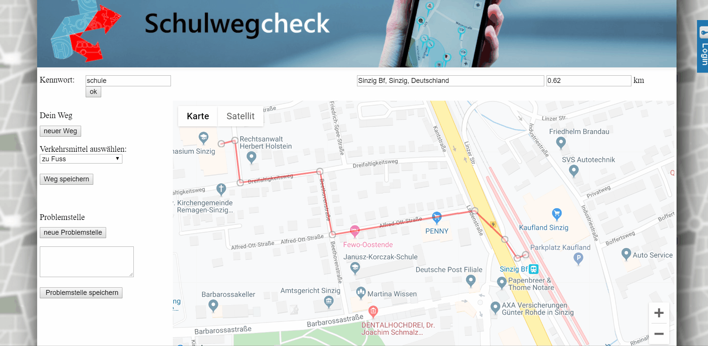

# Schulwegcheck

## Hinweis

Die Eingabe des Schulweges erfolgt freiwillig. Sprich mit Deinen Eltern, ob Du diese Angabe machen darfst. Eventuell kannst Du, um nicht den genauen Startpunkt anzugeben, den Weg ab einer Kreuzung in der Nähe Deines Wohnorts beginnen.
Es reicht aus den Weg ab der Stadtgrenze Sinzig einzugeben.

## Aufrufen der Webseite

Hier ist der [Schulwegcheck](https://www.schulwegcheck.de) verlinkt.
Danach muss Du zunächst das Tab **Karte** auswählen und danach **Wegpunkte/Schulrouten** auswählen. Jetzt musst Du ein Passwort eingegeben. Zum Üben kannst Du die Eingaben mit dem Testpasswort **`schule`** durchführen. Eventuell helfen Dir Deine Eltern bei der Beantwortung, Du kannst Dir auch Notizen auf einen Zettel machen (z.B. genauer Name der Haltestellen) und diesen später nutzen, wenn die Befragung an der Schule durchgeführt wird. Das tatsächliche Passwort gibt Dir Dein Lehrer erst während der Befragung.

## Wege eingeben

Der Schulweg wird jeweils für ein Verkehrsmittel eingegeben. Wenn Du erst mit dem Fahrrad zum Bahnhof nach Bad Breisig fährt, danach mit dem Zug zum Bahnhof Sinzig und danach zu Fuß weiter zum Rhein-Gymnasium gehst, musst Du also drei Wege eingegeben. Interessant sind dabei aber nur die Wege in Sinzig, so dass Du Dir die Eingabe erleichtern kannst, indem Du nur den Schulweg innerhalb von Sinzig einträgst. Für den obigen Fall, reicht es also aus anzugeben, dass Du mit dem Zug von Bad Breisig nach Sinzig fährst (1. Weg: Bahnfahrt) und dann zu Fuß vom Bahnhof zum RGS gehst (2. Weg: Fußweg). Wenn Du im Sommer den kompletten Schulweg mit dem Fahrrad zurücklegst, solltest Du diesen noch als 3. Weg eingeben.

* Für jeden Weg muss der Knopf **neuer Weg** gedrückt werden.
* Jetzt sollte das richtige Verkehrsmittel am Auswahlmenü gewählt werden.
* Das Suchfeld kann benutzt werden um einen Startpunkt zu finden.
* Danach kann der Weg durch entsprechende Wegmarken beschrieben werden. Dabei setzt ein **einfacher Linksklick** eine Markierung.
* Falsch gesetzte Markierungen können mit einen **doppelten Linksklick** gelöscht werden.
* Nachdem ein Zielpunkt erreicht ist muss der Weg über den Knopf **Weg speichern** gespeichert werden.
* Nun sollten sofort die Problemstellen für diesen Weg eingegeben werden, da immer nur der aktuelle Weg angezeigt wird!

## Problemstelle hinzufügen

Für jeden Teil des Schulwegs können mehrere Problemstelle markiert werden. 

* Für jeden Problemstelle muss der Knopf **neuer Problemstelle** gedrückt werden.
* Danach kann durch einen **einfachen Rechtsklick** ein Marker für die Problemstelle gesetzt werden.
* Dieser Marker kann bei **gedrückter linker Maustaste** noch verschoben werden bzw. durch **doppelten Linksklick** gelöscht werden.
* Danach sollte noch eine Beschreibung der Problemstelle angegeben werden (z.B. parkende Autos versperren die Sicht, kein Fußgängerüberweg, fehlender Fahrradweg, schlechte Beleuchtung etc.)
* Die Problemstelle wird dann über **Problemstelle speichern** gesichert.

**Diese beiden Schritte werden dann für alle Abschnitte des Schulwegs angegeben.**
