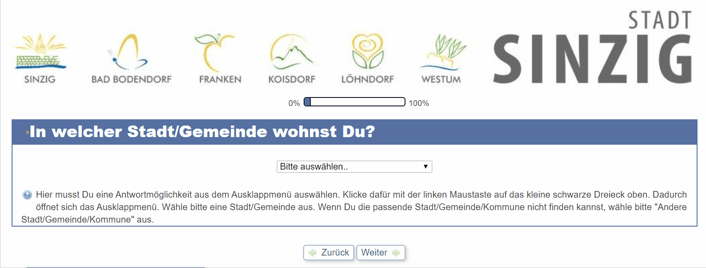
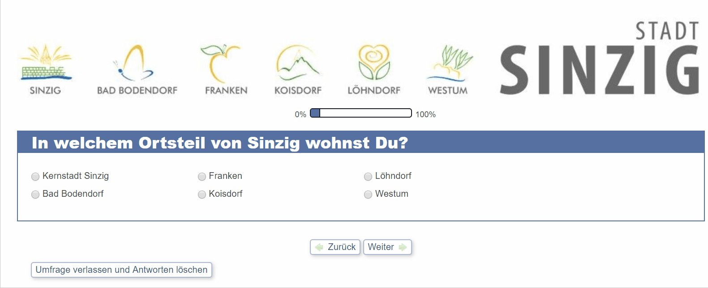
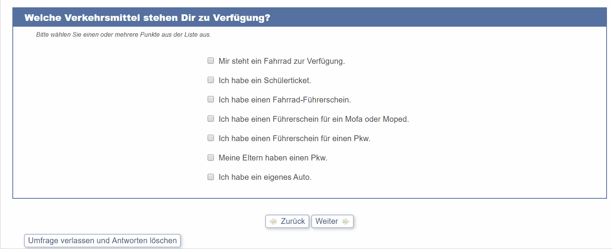
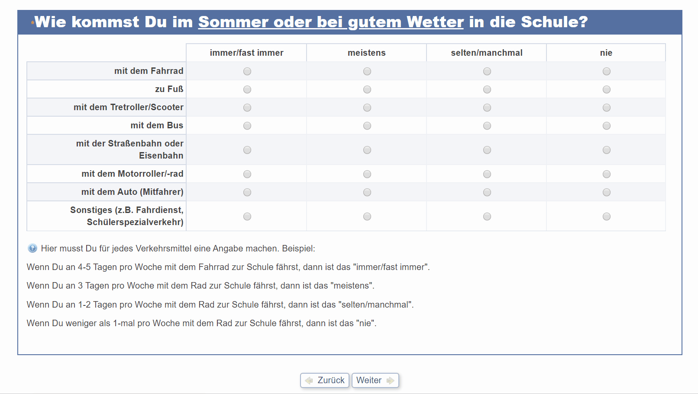
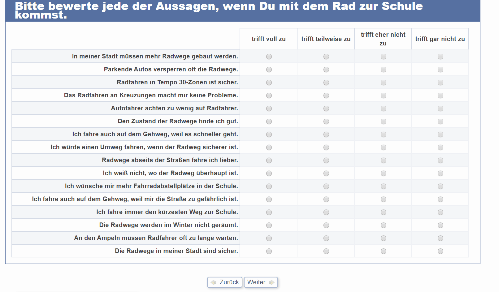
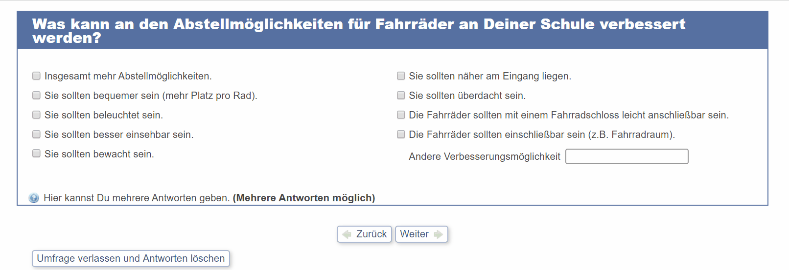
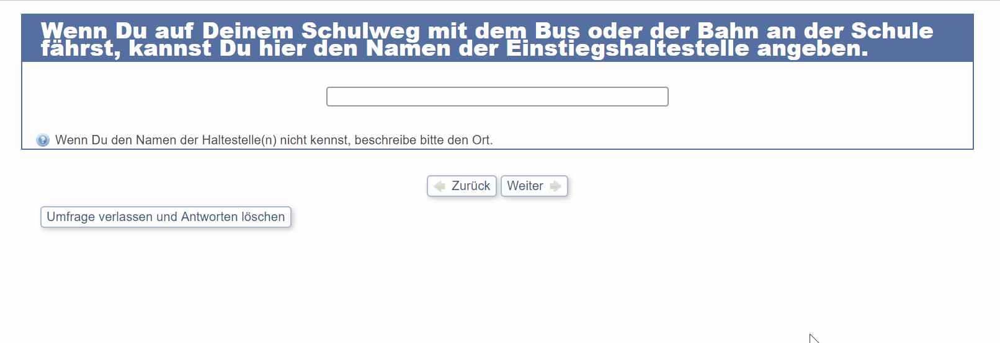
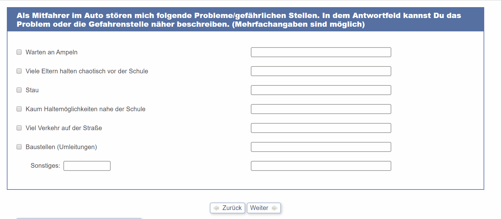

**Die Befragung findet man unter diesem [Link](http://www.schulwegcheck.de/limesurvey/index.php/survey/index/sid/526655/newtest/Y/lang/de).**

## Zugangspasswort

Das Passwort für den Testzugang lautet **`99999`**. Das Passwort für die tatsächliche Befragung erhältst Du von Deinem Lehrer am Tag der Befragung.

## Verschieden Arten von Fragen

Je nach Frage müssen mindestens eine, mehrere oder keine Antwort gegeben werden. Die verschiedenen Frageformen werden hier kurz vorgestellt. Bei einem Testlauf mit dem Passwort **`99999`** kannst Du bereits jetzt schon alle Fragen ansehen. Wenn Du Fragen nicht verstehst sprich mit Deinen Eltern oder Deinem Lehrer.

### Ausklappmenu

Manche Fragen haben ein sogenanntes Auswahlmenu.

### Auswahlfragen

Auswahlfragen haben nur eine mögliche Antwort - sobald Du eine zweite Antwort auswählst, wird der vorherige Wert gelöscht.

### Mehrfachauswahl

Einige Fragen geben Dir die Möglichkeit mehrere Antworten auszuwählen. Du kannst alles zutreffende auswählen.

### Fragen zu Verkehrsmitteln

Zwei sehr wichtige Fragen werden zu den Verkehrsmitteln, mit Denen Du je nach Wetterlage zur Schule kommst, gestellt. Dabei musst Du in **jeder Zeile** - nach den angegebene Regeln - jeweils einen Eintrag auswählen.
**Alle nachfolgenden Fragen werden abhängig von dieser Übersicht angezeigt!** Du kannst nachfolgend also nur Fragen zu Verkehrsmitteln, die Du tatsächlich nutzt beantworten.

### Frage an Fahrradfahrer

Wenn Du mit dem Fahrrad zur Schule kommst solltest Du hier jeweils pro Zeile eine Antwort angeben.

Es gibt auch Fragen mit Freitext, die Du ausfüllen kannst.

### Fragen an Nahverkehr

Wenn Du mit Bus oder Bahn anreist kannst Du dazu auch Angaben machen.

Später gibt es entsprechend zu den Fahrrad-Fragen auch Fragen zu Bus und Bahn, die betroffene Schüler beantworten sollen.

### Allgemeine Fragen zu Problemen bei der Anreise

Für alle Verkehrsmittel wird abgefragt, zu welchen Problemen es kommt. Du kannst bei allen bestimmte Punkte auswählen und diese durch Freitextfelder erläutern.

### Ende der Befragung

Nachdem Du den ersten Teil beantwortet hast wirst Du auf die Seite des [Schulwegchecks](Schulwegcheck.md) weitergeleitet. Dort kannst Du Angaben zu Deinem Schulweg machen.
